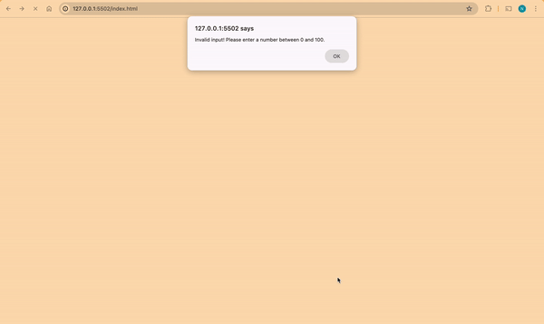

# WK1-Code-Challenge

#### Date, 23/03/2024

#### By Najib Iman

## Project 1 Demo


## Description
Week 1 code challenge, We were given three challenges:
1. Write a program that prompts the user to input student marks. The input should be between 0 and 100. Then output the correct grade: 
// A > 79, B - 60 to 79, C -  49 to 59, D - 40 to 49, E - less 40.

2. Write a program that takes as input the speed of a car e.g 80. If the speed is less than 70, it should print “Ok”. Otherwise, for every 5 km/s above the speed limit (70), it should give the driver one demerit point and print the total number of demerit points.

3. Write a program whose major task is to calculate an individual’s Net Salary by getting the inputs of basic salary and benefits. Calculate the payee (i.e. Tax), NHIFDeductions, NSSFDeductions, gross salary, and net salary. 

## Heads Up
For the first code challenge run the program with live server!

## Installation
You use git clone to be able to download the documents in the GitHub

## Installation Requirements
Git

### Installation instruction
```
Git clone https://github.com/najibdevs/WK1-Code-Challenge

```

## Technologies used
HTML
Github
Javascript

## Support and contact details
github.com/najibdevs

### License
The content of this site is licensed under the MIT license
Copyright (c) 2024.

